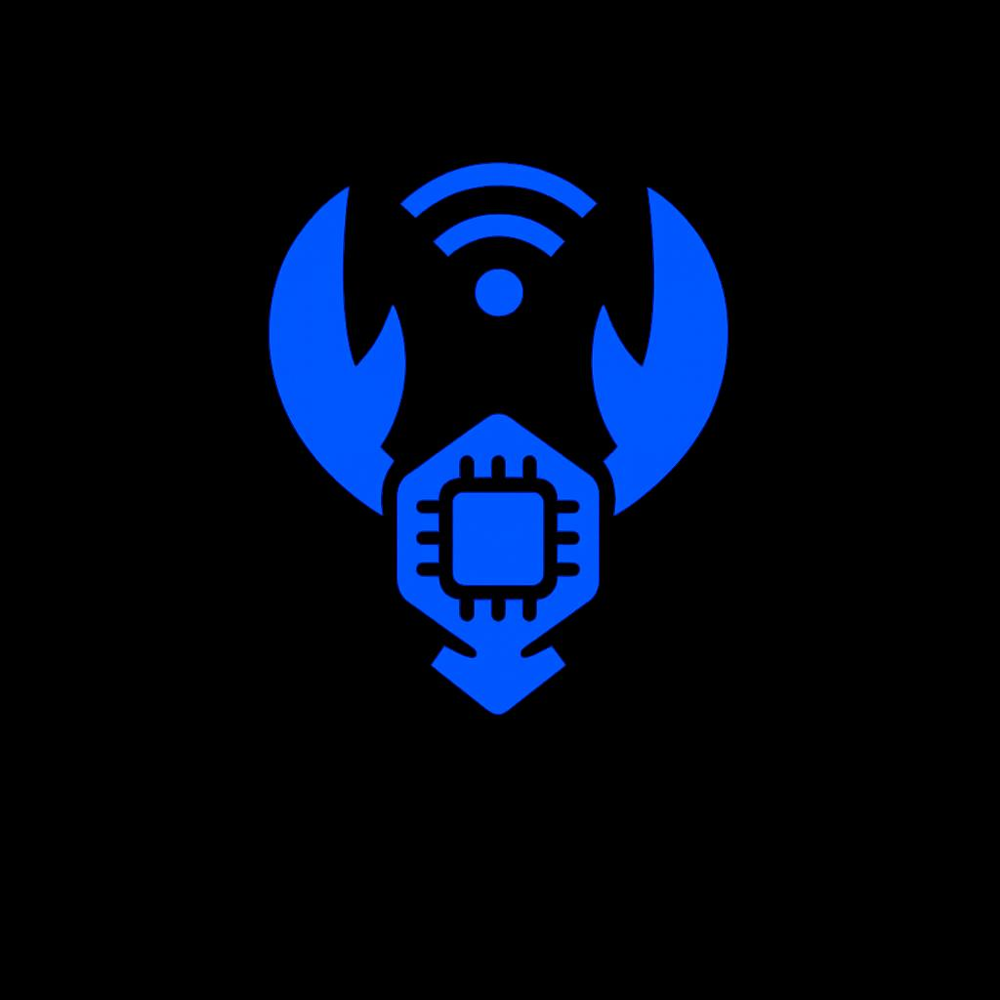
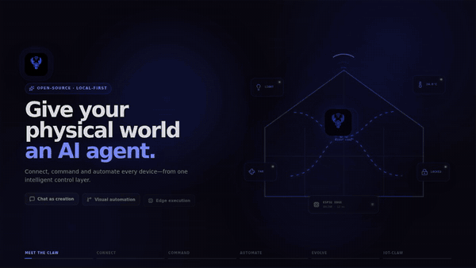

<div align="center">
  

  # IoT-Claw
  ### The Intelligent AI Agent Framework & Smart Home Control Console
  

  `💬 Chat as Creation` · `🚀 Millisecond Response` · `🧩 Smart and Extensible` · `🧠 Autonomous Learning`

  [](#)
  [](#)
  [](#)


</div>

<div align="center">
  
</div>

---

**IoT-Claw** is a next-generation smart home platform that turns your living space into an intelligent, conversational ecosystem. By combining advanced AI reasoning with standard smart home protocols (MQTT, Zigbee, Home Assistant), IoT-Claw enables you to program, monitor, and command physical hardware using simple, natural language.

Whether you are looking to build a beautiful, high-performance local control dashboard, design visually stunning drag-and-drop automations, or deploy self-optimizing AI agents that manage your environment's energy and comfort, IoT-Claw provides a unified, local-first platform designed to grow with you.

---

## ✨ Features & Capabilities

### 💬 Conversational Command Console
Command your space using standard human sentences. Powered by advanced local and cloud-based LLMs, the AI agent interprets your intent, dynamically triggers multi-device events, and streams its thoughts in real-time.
* **Fluid Streaming Responses:** Watch the AI formulate its actions token-by-token with near-instantaneous execution.
* **Sequential Multi-Action Queueing:** Command complex operations in a single phrase: *"Turn on the patio heater, wait 20 seconds, then set the backyard lights to a warm amber."*
* **Smart Device Registry Querying:** Instantly ask questions about your home: *"Are there any active motion alerts in the garage?"* or *"What sensors are currently reporting offline?"*

---

### 🔌 Visual Drag-and-Drop Automation Editor
Build complex routines visually without writing a single line of YAML or code. IoT-Claw features an interactive node editor built on `@xyflow/react`.
* **Dynamic Event Triggers:** Fire automation chains using calendar schedules, custom chat triggers, or real-time sensor thresholds (temperature, humidity, motion).
* **Live Flow Visualization:** Watch nodes pulse and glow in real-time as execution paths fire, loops delay, and actions trigger on your dashboard.
* **Edge Compilation:** Instantly compile your visual sensor workflows into compact MicroPython scripts and deploy them straight to your edge microcontrollers over the air.

---

### 🧠 The Autonomous Claw Sandbox
Operate your home on a self-improving agentic reasoning loop. Turn on Autonomous Mode and let the sandbox agent manage and maintain your IoT network.
* **Auto-Discovery:** Scans MQTT networks and Home Assistant hubs for new, unconfigured hardware.
* **Goal-Driven Self-Correction:** Set high-level objectives (*"Keep the study room climate optimized and energy efficient"*), and watch the AI write, simulate, test, and debug scripts inside its virtual sandbox until the goals are achieved.

---

### ⚡ Web Serial Browser-Direct Flashing
Get new hardware connected to your network in seconds with zero development tools or IDE installs required.
* **Direct USB Connection:** Plug your ESP32 controller into your PC, open the **Flash** panel in Chrome or Edge, and establish a serial interface.
* **Credentials Injection:** Write WiFi SSIDs, passwords, and local broker coordinates directly into the controller's binary storage at the moment of flashing.

---

### 🏠 Universal Home Assistant & Zigbee Integrations
Bring your entire hardware stack under one local controller. 
* **Home Assistant Adapter:** Automatically maps and imports all your existing HA entities (lights, media players, locks, climate systems) with bidirectional WebSocket state synchronization.
* **Zigbee2MQTT Manager:** Pair, rename, monitor, and configure any standard Zigbee device natively using the interactive Zigbee manager.

---

### 🔔 OpenCV Security Feeds & Telegram Routing
Keep your home secure with real-time analytics. IoT-Claw includes camera integrations that connect your computer webcam or RTSP security camera feeds.
* **Computer Vision Alerts:** Processes active video feeds to detect motion, faces, or objects.
* **Mobile Alerts Routing:** Instantly captures video frame snapshots during alert events and routes the image data directly to your Telegram chat.

---

### 🎨 Sleek Neumorphic Control Interface
A dashboard that looks like high-end physical hardware. Designed around a dark neumorphic visual language, it features:
* **Deep Beveled Panels:** Frosted inset control plates and soft tactile indicators.
* **LED Status Rings:** Glowing halo rings that pulse in green (online), amber (evaluating), and red (offline).
* **Terminal Diagnostics:** Integrated debug outputs formatted in JetBrains Mono for clean reading.

---

## 💬 Chat Command Showcase

Command | Platform Response & Actions
:--- | :---
*"Turn on the laptop security camera and run a quick sweep"* | 🟢 *Camera online. Simulating OpenCV frames.* Sends command payload to camera nodes.
*"Turn off the living room fan, wait 10 seconds, then toggle the lobby lights"* | ⚡ *Executing sequence.* Schedules actions, holds for a 10s cooldown, then broadcasts state change.
*"If the main light is on, make sure the backup dimmer is set to 20%"* | 🧩 *Workflow rule registered.* Creates a threshold event link inside the execution database.

---

## 📐 Technical Architecture & Blueprints

> [!NOTE]
> All primary database logic, background execution adapters, and micro-agent interpreters are designed to run fully locally, preserving local network speed and user privacy.

### System Connections


---

### File Registry

```
IoT-Claw/
├── backend/
│   ├── app/
│   │   ├── core/
│   │   │   ├── db.py               # SQLite database setup and WAL mode config
│   │   │   └── storage.py          # Data models, persistence layer, SQL wrappers
│   │   ├── services/
│   │   │   ├── ai_agent.py         # OpenAI GPT streaming agent & tool-binding core
│   │   │   ├── autonomous_agent.py # Agentic loop, virtual testing, self-improving sandbox
│   │   │   ├── edge_compiler.py    # Compiles visual workflows into MicroPython code
│   │   │   ├── execution_engine.py # Rule-engine, cron schedules, trigger-action dispatcher
│   │   │   ├── ha_adapter.py       # Home Assistant WebSocket adapter & entity syncing
│   │   │   ├── mcp_client.py       # Model Context Protocol client for edge tool invocation
│   │   │   ├── mqtt_client.py      # MQTT pub/sub client with local response registries
│   │   │   ├── push_service.py     # Frontend WebSocket real-time event broadcaster
│   │   │   ├── security_camera.py  # OpenCV-based camera frame grabber and body detection
│   │   │   ├── telegram_bot.py     # Interactive Telegram command interpreter bot
│   │   │   ├── telegram_notify.py  # Telegram alert push notifications dispatcher
│   │   │   └── zigbee_adapter.py   # Zigbee2MQTT bridge adapter and network permit-joining
│   │   └── main.py                 # FastAPI application root, endpoints, lifespan manager
│   ├── .env                        # Active system environment variables file
│   ├── iot_claw.db                 # SQLite database storage (WAL mode)
│   ├── requirements.txt            # Python backend dependencies
│   └── run_server.bat              # Batch utility to start FastAPI via uvicorn
│
├── frontend/
│   ├── public/
│   │   ├── logo.jpg                # IoT-Claw circular dark-neumorphic logo image
│   │   └── manifest.json / sw.js   # Progressive Web App configuration and service worker
│   ├── src/
│   │   ├── components/
│   │   │   ├── ActivityLog.jsx     # Live system logs console
│   │   │   ├── AutonomousClaw.jsx  # Autonomous AI sandbox controls and cycle viewer
│   │   │   ├── Chat.jsx            # Streaming AI Command Console with typing dots
│   │   │   ├── Dashboard.jsx       # Neumorphic overview grid with widgets
│   │   │   ├── DeviceCard.jsx      # Multi-type interactive widget cards
│   │   │   ├── Devices.jsx         # Device registration and controller grid
│   │   │   ├── EdgeConsole.jsx     # MicroPython edge console logs and script rolls
│   │   │   ├── FlashDevice.jsx     # ESP32 firmware installer (Web Serial UI)
│   │   │   ├── HAManager.jsx       # Home Assistant diagnostic panel and entity controllers
│   │   │   ├── TemplateLibrary.jsx # Visual visual automation presets
│   │   │   ├── WorkflowEditor.jsx  # React Flow drag-and-drop workflow architect
│   │   │   └── ZigbeeManager.jsx   # Zigbee pairing status and device renamer/remover
│   │   ├── hooks/
│   │   │   ├── useWebSocket.js     # Global real-time state synchronization
│   │   │   └── usePushNotifications.js  # Push notifications controller
│   │   ├── App.jsx                 # Multi-view main container & navbar manager
│   │   ├── index.css               # Neumorphic CSS design system rules
│   │   └── main.jsx                # Web entry point
│   ├── package.json                # Frontend package dependencies
│   └── vite.config.js              # Vite assembly settings
│
├── hardware/
│   ├── esp32_dual_led_mqtt/        # C++ dual LED control Arduino code
│   ├── micropython_edge_agent.py   # MicroPython ESP32 edge client with dynamic interpreter
│   └── ESP32_SETUP.md              # Flash guide and wiring schematics
```

---

### SQLite WAL Database Layout

The local persistence module tracks parameters across six structured SQL tables:
* **`devices`:** High-level details for active simulated, MQTT, HA, or Zigbee nodes, including physical coordinates, status strings, firmware capability lists, and camera capture markers.
* **`telemetry`:** Raw indexed time-series logs of numeric sensor readings, fully indexed to deliver lightning-fast historical telemetry querying and sparkline loads.
* **`workflows`:** Node layout coordinates, trigger limits, conditional rules, and edge compiler state metrics.
* **`script_history`:** Dynamic python source scripts pushed over-the-air to MicroPython nodes.
* **`logs`:** Multi-level logs detailing socket activity, background checks, system errors, and MQTT messages.
* **`captures`:** Binary SQLite BLOB cells storing actual body and motion captures with timing tags and category strings.

---

### Environment Setup (`.env`)

Configure your environment settings inside `backend/.env`. Below are all available core fields:

```env
# OpenAI Brain Config
OPENAI_API_KEY=sk-proj-your-openai-api-key
OPENAI_MODEL=gpt-5-nano

# Network Ports
MQTT_BROKER_HOST=localhost
MQTT_BROKER_PORT=1883
EXECUTION_ENGINE_INTERVAL=5

# OpenCV Security Camera Simulator
SECURITY_CAMERA_DEVICE_NAME=laptop_security_camera
SECURITY_CAMERA_TOPIC_BASE=simulator/laptop_security_camera
SECURITY_CAMERA_INDEX=0
SECURITY_CAMERA_ALERT_COOLDOWN=60
SECURITY_CAMERA_CAPTURE_DIR=captures

# Telegram Bot Integration
TELEGRAM_BOT_TOKEN=
TELEGRAM_CHAT_ID=

# Zigbee2MQTT Bridge Adapter
ZIGBEE2MQTT_BASE_TOPIC=zigbee2mqtt
ZIGBEE2MQTT_ENABLED=true

# Home Assistant Integration
HA_ENABLED=true
HA_HOST=127.0.0.1
HA_PORT=8123
HA_TOKEN=your-ha-long-lived-token
HA_DOMAIN_FILTER=media_player,light,switch,climate,fan,cover,lock

# Autonomous AI Sandbox Settings
AUTONOMOUS_AGENT_ENABLED=false
AUTONOMOUS_AGENT_INTERVAL=60
AUTONOMOUS_AGENT_AGGRESSION=medium
AUTONOMOUS_AGENT_MAX_ACTIONS=3
```

---

## 🚀 Installation & Running

### 1. Fire up the Backplane API
```bash
cd backend
python -m venv venv
venv\Scripts\activate  # On macOS/Linux: source venv/bin/activate
pip install -r requirements.txt
```
Start the uvicorn web server:
```bash
python -m uvicorn app.main:app --port 8000 --reload
```

### 2. Launch the Control Console
```bash
cd frontend
npm install
npm run dev
```
Explore the dashboard locally on `http://localhost:5173`.

---

## 🛠️ Hardware Setup (ESP32)

### Pinout Configuration (Dual LED / Relay)
For the pre-configured dual LED/Relay Arduino sketch, connect your ESP32 as follows:
* **LED 1 (GPIO 26):** Connects to GPIO 26 through a `220Ω` resistor to the anode, and cathode to `GND`.
* **LED 2 (GPIO 27):** Connects to GPIO 27 through a `220Ω` resistor to the anode, and cathode to `GND`.

### Direct Web Flashing (Recommended)
1. Plug your ESP32 into a USB port.
2. Open the **Flash** tab on your IoT-Claw console.
3. Configure WiFi parameters and MQTT broker credentials in the form.
4. Click **Flash Firmware** to write the binary directly over the serial connection.

### Manual Arduino Upload
1. Open the sketch `hardware/esp32_dual_led_mqtt/esp32_dual_led_mqtt.ino` in Arduino IDE.
2. Enter your WiFi coordinates and MQTT network IP address.
3. Install the `PubSubClient` library.
4. Compile and upload to your ESP32 board!

---

## 🆘 Troubleshooting

| Diagnostic Symptom | Root Cause | Solution
| :--- | :--- | :---
| **Uvicorn fails to start app** | Wrong active terminal folder. | Ensure you are located inside the `backend` folder when executing the uvicorn startup command.
| **Zigbee device fails to join network** | Joining window closed. | Open the **Zigbee Manager** panel, click **Permit Join**, and restart your physical Zigbee device.
| **OpenCV Camera fails to capture** | Wrong active index. | Verify the `SECURITY_CAMERA_INDEX` in `.env` corresponds to the correct device ID (e.g. `0` for the laptop webcam).
| **Telemetry sparklines are empty** | Missing telemetry database updates. | Ensure MQTT topics or Home Assistant statuses are firing values. Toggle a device in the UI to trigger a fresh broadcast update.

---

<div align="center">
  <sub>Made with ❤️ by the IoT-Claw Team</sub>
</div>
