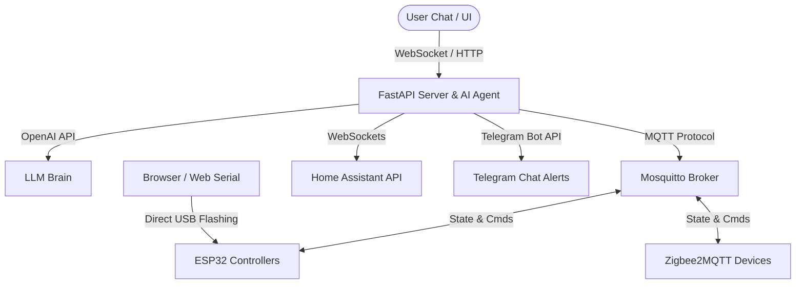

<div align="center">
  

  # IoT-Claw 🦞
  ### AI Agent Framework & Smart Home Automation Platform

  `💬 Chat as Creation` · `🚀 Millisecond Response` · `🧩 Smart and Extensible` · `🧠 Autonomous Learning`

  [](#)
  [](#)
  [](#)

  [Home](#) | [Docs](#) | [Online Flashing](#) | [Build from Source](#) | [简体中文](#)
</div>

---

**IoT-Claw** is a next-generation **Chat-to-Creation AI Agent framework** and automation controller for smart homes and IoT devices. It defines device behavior through conversation and completes the full loop of sensing, decision-making, and execution locally. 

Inspired by the OpenClaw concept, IoT-Claw is lightweight, intelligent, and continuously evolving. With just an ESP32-series chip (or standard Zigbee/MQTT/Home Assistant devices) and our sleek, hardware-inspired neumorphic dashboard, you can build, simulate, flash, and command your own intelligent automation ecosystem in seconds.

---

## 📐 System Architecture

IoT-Claw leverages a highly responsive, event-driven local architecture. The AI Agent coordinates real-time data from MQTT, Home Assistant, and browser Web Serial, routing critical updates instantly to the user and their connected Telegram alert channels.



---

## ⚡ Core Capabilities

### 💬 Chat as Creation — Streaming AI Agent
Control your home via fluid, conversational commands. The AI Agent automatically infers device intents, coordinates complex operations, and calls custom backend tools in real time.
* **Token-by-Token Streaming:** Watch the AI formulate responses in real-time with zero latency.
* **Intelligent Tool-Calling:** The agent dynamically binds tools to read device states, register devices, and configure automation rules.
* **Multi-Step Execution:** Queue complex actions automatically: *"Turn on the bedroom fan, wait 15 seconds, then turn on the light."*

### 🧠 Autonomous Claw — The Agentic Sandbox
Step into the future with a fully autonomous playground where the AI Agent operates on a self-improving execution loop.
* **Device Discovery:** Automatically scans your MQTT and Home Assistant registries to discover unconfigured hardware.
* **Self-Correcting Action Loops:** Set high-level goals (*"Optimize climate control for the living room"*), and watch the AI write, test, and debug scripts until the objective is met.
* **Virtual Experiments:** Safe sandbox environment to model complex home rules before committing them to physical hardware.

### 🔌 Visual Drag-and-Drop Workflow Builder
Say goodbye to complex configuration files and YAML scripts. IoT-Claw features a state-of-the-art node editor built on `@xyflow/react` (React Flow).
* **Multiple Triggers:** Create routines that trigger on **Schedules** (time-based), **Sensor Thresholds** (temperature/humidity), or custom **Chat Commands**.
* **Flexible Logic:** Chain delay nodes, conditional checks, action nodes, and external alert triggers together.
* **Live Execution Sync:** Monitor active workflows as they execute node-by-node with glowing visual status paths.

### ⚡ Web Serial Online Flashing
Flash custom IoT-Claw firmware to your ESP32 devices directly from the browser — no Arduino IDE or CLI tools required!
* **Plug & Play:** Connect your ESP32 via USB and click **Connect** on the dashboard.
* **Browser Flashing:** Uses the Web Serial API to upload pre-compiled binary firmware instantly.
* **Dynamic Config Injection:** Auto-configures WiFi credentials and your local MQTT broker address directly into the device during the flashing process.

### 🏠 First-Class Home Assistant Adapter
Unify your entire smart home. IoT-Claw integrates natively with **Home Assistant** to control over 2,500 brands out of the box.
* **Instant Import:** Discovers and maps all HA entities (lights, switches, media players, locks, covers, fans) automatically.
* **Bi-directional WebSocket Sync:** Any changes made in Home Assistant or physically in the room reflect instantly on your Neumorphic Console.

### 🔔 Integrated Telegram Alerts
Stay informed no matter where you are. IoT-Claw routes critical alerts directly to your personal Telegram chat.
* **Security Feeds:** Receives motion and face detection capture frames from local security cameras.
* **Critical Alerts:** Notifies you immediately if sensor values spike or hardware goes offline.
* **Workflow Logs:** Dispatches summaries of successfully triggered automation routines.

---

## 🎨 Modern Hardware Neumorphic UI

The control console features a dark, immersive, hardware-inspired neumorphic design system:
* **Deep Space Contrast:** Sleek `#1a1d21` backgrounds with soft bevels and inset shadow wells.
* **Vibrant LED Accents:** Glow-enhanced indicators (green for online, amber for thinking, red for offline).
* **Glassmorphism Panels:** Semi-transparent frosted layers that create depth and visual structure.
* **JetBrains Mono Typography:** Fully optimized terminal fonts for debug logs, code blocks, and data output.

---

## 🚀 Quick Start Guide

> [!IMPORTANT]
> To use the AI capabilities, you will need a valid **OpenAI API Key**. For local communication, a running **MQTT Broker** (e.g. Mosquitto) is required.

### 📦 Installation & Setup

#### 1. Configure the Backend
Clone the repository and prepare the Python environment:
```bash
cd backend
python -m venv venv
venv\Scripts\activate  # On macOS/Linux: source venv/bin/activate
pip install -r requirements.txt
```

Create a `backend/.env` file with your configuration:
```env
OPENAI_API_KEY=sk-proj-your-openai-api-key
MQTT_BROKER_HOST=localhost
MQTT_BROKER_PORT=1883
STORAGE_FILE=storage.json
EXECUTION_ENGINE_INTERVAL=2

# Home Assistant (Optional)
HA_HOST=192.168.1.150
HA_PORT=8123
HA_TOKEN=your-long-lived-access-token

# Telegram Alert Configuration (Optional)
TELEGRAM_BOT_TOKEN=your-telegram-bot-token
TELEGRAM_CHAT_ID=your-chat-id
```

Start the FastAPI application:
```bash
python main.py
```
The API server will launch at `http://localhost:8000`.

#### 2. Run the MQTT Broker
Ensure Mosquitto is running on your system:
```bash
# Using Docker
docker run -it -p 1883:1883 eclipse-mosquitto
```

#### 3. Start the Neumorphic Web Console
Navigate to the frontend directory, install dependencies, and launch Vite:
```bash
cd frontend
npm install
npm run dev
```
Open your browser and navigate to `http://localhost:5173`.

---

## 🛠️ Hardware Setup (ESP32)

### Pinout Configuration (Dual Relay/LED)
For the pre-configured dual LED/Relay sample code, connect your ESP32 as follows:
* **LED 1 (GPIO 26):** Connects to GPIO 26 through a `220Ω` resistor to the anode, and cathode to `GND`.
* **LED 2 (GPIO 27):** Connects to GPIO 27 through a `220Ω` resistor to the anode, and cathode to `GND`.

### Flashing via Web Serial (Recommended)
1. Navigate to the **Flash** tab in the IoT-Claw Web Console.
2. Select your serial port.
3. Enter your **WiFi SSID**, **WiFi Password**, and **MQTT Broker IP**.
4. Click **Flash Firmware** to automatically compile and upload the firmware.

### Flashing via Arduino IDE
1. Open the sketch located at `hardware/esp32_dual_led_mqtt/esp32_dual_led_mqtt.ino`.
2. Replace the credentials placeholders with your WiFi credentials and your computer's local network IP address (as the MQTT host).
3. Install the `PubSubClient` library in Arduino IDE.
4. Select your ESP32 board and upload!

---

## 💬 Command Examples

Try typing these commands in the **AI Command Console**:

| Category | Example Command | Expected Response / Tool Triggered |
| :--- | :--- | :--- |
| **Control** | *"Turn on the living room light"* | Publishes `ON` to `home/living_room/light/set` |
| **Dimmers** | *"Dim the bedroom light to 60%"* | Publishes `153` to `home/bedroom/light/dim/set` |
| **Workflows**| *"At 10:30 PM turn off the kitchen light"*| Registers a schedule workflow executing at `22:30` |
| **Sequences**| *"Turn on fan, wait 10s, then turn off"* | Triggers sequential execution engine with delay |
| **Status** | *"Are any devices currently offline?"* | Scans registry and returns status of all devices |

---

## 🆘 Troubleshooting

> [!TIP]
> Setting `EXECUTION_ENGINE_INTERVAL=1` in your `.env` file reduces automation check latency down to 1 second.

| Issue | Cause | Solution |
| :--- | :--- | :--- |
| **ESP32 won't connect to MQTT** | Firewall blocking or wrong IP. | Ensure your computer's network profile is set to Private. Set Mosquitto config to listen on `0.0.0.0:1883` (`allow_anonymous true`). |
| **Devices show offline on dashboard** | Stale status or MQTT disconnect. | Toggle the device state in the UI once to trigger a state republish. |
| **Chat API returns 401 error** | Missing or incorrect API key. | Check that your `OPENAI_API_KEY` is correctly defined in `backend/.env` without quotes. |
| **Web Serial port not found** | Missing USB driver or restricted browser. | Ensure you are using Google Chrome, Microsoft Edge, or Opera. Check if you need to install the CP210x or CH340 USB-to-UART driver. |

---

<div align="center">
  <sub>Made with ❤️ by the IoT-Claw Team</sub>
</div>
