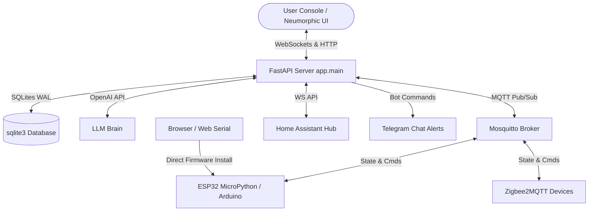

<div align="center">
  

  # IoT-Claw 
  ### AI Agent Framework & Smart Home Automation Platform

  `💬 Chat as Creation` · `🚀 Millisecond Response` · `🧩 Smart and Extensible` · `🧠 Autonomous Learning`

  [](#)
  [](#)
  [](#)

  [Home](#) | [Docs](#) | [Online Flashing](#) | [Build from Source](#) | [简体中文](#)
</div>

---

**IoT-Claw** is a full-stack, local-first smart home platform and **Chat-to-Creation AI Agent framework** for IoT devices. It bridges physical hardware, visual automations, and advanced natural-language reasoning under one cohesive neumorphic interface. 

It defines device behaviors through conversation and executes the full loop of **sensing, decision-making, and execution** locally using standard MQTT, Zigbee, Home Assistant, and ESP32 nodes. Inspired by the OpenClaw concept, IoT-Claw is lightweight, intelligent, and continuously evolving.

---

## 📐 System Architecture

IoT-Claw coordinates multiple real-time protocols through a centralized, high-performance FastAPI backplane. Device telemetry is logged locally to SQLite in WAL mode, workflows are evaluated dynamically in the background, and all updates are pushed instantly via bidirectional WebSockets.



---

## 📂 Project Structure

Here is the exact, complete file structure of the IoT-Claw platform:

```
IoT-Claw/
├── backend/
│   ├── app/
│   │   ├── core/
│   │   │   ├── db.py               # SQLite database initializer and WAL mode config
│   │   │   └── storage.py          # Data models, telemetry history, and SQL persistence
│   │   ├── services/
│   │   │   ├── ai_agent.py         # OpenAI GPT streaming agent & tool-binding core
│   │   │   ├── autonomous_agent.py # Agentic loop, virtual testing, self-improving sandbox
│   │   │   ├── edge_compiler.py    # Compiles visual workflows into MicroPython edge code
│   │   │   ├── execution_engine.py # Rule-engine, cron schedules, and action dispatcher
│   │   │   ├── ha_adapter.py       # Home Assistant WebSocket adapter & entity syncing
│   │   │   ├── mcp_client.py       # Model Context Protocol client for edge tool invocation
│   │   │   ├── mqtt_client.py      # MQTT pub/sub client with local response registries
│   │   │   ├── push_service.py     # Frontend WebSocket real-time event broadcaster
│   │   │   ├── security_camera.py  # OpenCV-based camera frame grabber and body detection
│   │   │   ├── telegram_bot.py     # Interactive Telegram command interpreter bot
│   │   │   ├── telegram_notify.py  # Telegram alert push notifications dispatcher
│   │   │   └── zigbee_adapter.py   # Zigbee2MQTT bridge adapter and network permit-joining
│   │   └── main.py                 # FastAPI application root, endpoints, lifespan manager
│   ├── .env                        # Active system environment variables file
│   ├── iot_claw.db                 # SQLite database storage (WAL mode)
│   ├── requirements.txt            # Python backend dependencies
│   └── run_server.bat              # Batch utility to start FastAPI via uvicorn
│
├── frontend/
│   ├── public/
│   │   ├── logo.jpg                # IoT-Claw circular dark-neumorphic logo image
│   │   └── manifest.json / sw.js   # Progressive Web App configuration and service worker
│   ├── src/
│   │   ├── components/
│   │   │   ├── ActivityLog.jsx     # Live system logs console
│   │   │   ├── AutonomousClaw.jsx  # Autonomous AI sandbox controls and cycle viewer
│   │   │   ├── Chat.jsx            # Streaming AI Command Console with typing dots
│   │   │   ├── Dashboard.jsx       # Neumorphic overview grid with widgets
│   │   │   ├── DeviceCard.jsx      # Multi-type interactive widget cards
│   │   │   ├── Devices.jsx         # Device registration and controller grid
│   │   │   ├── EdgeConsole.jsx     # MicroPython edge console logs and script rolls
│   │   │   ├── FlashDevice.jsx     # ESP32 firmware installer (Web Serial UI)
│   │   │   ├── HAManager.jsx       # Home Assistant diagnostic panel and entity controllers
│   │   │   ├── TemplateLibrary.jsx # Visual visual automation presets
│   │   │   ├── WorkflowEditor.jsx  # React Flow drag-and-drop workflow architect
│   │   │   └── ZigbeeManager.jsx   # Zigbee pairing status and device renamer/remover
│   │   ├── hooks/
│   │   │   ├── useWebSocket.js     # Global real-time state synchronization
│   │   │   └── usePushNotifications.js  # Push notifications controller
│   │   ├── App.jsx                 # Multi-view main container & navbar manager
│   │   ├── index.css               # Neumorphic CSS design system rules
│   │   └── main.jsx                # Web entry point
│   ├── package.json                # Frontend package dependencies
│   └── vite.config.js              # Vite assembly settings
│
├── hardware/
│   ├── esp32_dual_led_mqtt/        # C++ dual LED control Arduino code
│   ├── micropython_edge_agent.py   # MicroPython ESP32 edge client with dynamic interpreter
│   └── ESP32_SETUP.md              # Flash guide and wiring schematics
```

---

## 🗄️ SQLite Database Schema (`iot_claw.db`)

The persistence core is built entirely on SQLite with Write-Ahead Logging (WAL) for safe, parallel concurrency.

* **`devices`:** Holds active configuration records for simulated, MQTT, Zigbee, and Home Assistant entities. Contains hardware metadata (`ieee_address`, `vendor`, `model`), physical location (`location`), current status (`status`), and camera descriptors (`last_detection`, `last_snapshot`).
* **`telemetry`:** Stores high-frequency sensor readings mapped to devices, complete with a composite descending time index to support instant dashboard sparklines and CSV exports.
* **`workflows`:** Houses visual automation configurations mapped from React Flow in standard JSON (`config`), state parameters (`enabled`, `run_count`), and edge compiling states (`deployed_to_edge`).
* **`script_history`:** Holds script records (`script_content`) deployed to edge devices, enabling easy rollback and historical tracking.
* **`logs`:** General platform telemetry tracking system processes, API commands, and adapter messages.
* **`captures`:** Binary BLOB container storing physical camera images together with security details (`detected_types`).

---

## ⚙️ Configured Environment Variables (`.env`)

Configure your environment settings inside `backend/.env`. Below are all available core fields:

```env
# OpenAI Brain Config
OPENAI_API_KEY=sk-proj-your-openai-api-key
OPENAI_MODEL=gpt-5-nano

# Network Ports
MQTT_BROKER_HOST=localhost
MQTT_BROKER_PORT=1883
EXECUTION_ENGINE_INTERVAL=5

# OpenCV Security Camera Simulator
SECURITY_CAMERA_DEVICE_NAME=laptop_security_camera
SECURITY_CAMERA_TOPIC_BASE=simulator/laptop_security_camera
SECURITY_CAMERA_INDEX=0
SECURITY_CAMERA_ALERT_COOLDOWN=60
SECURITY_CAMERA_CAPTURE_DIR=captures

# Telegram Bot Integration
TELEGRAM_BOT_TOKEN=
TELEGRAM_CHAT_ID=

# Zigbee2MQTT Bridge Adapter
ZIGBEE2MQTT_BASE_TOPIC=zigbee2mqtt
ZIGBEE2MQTT_ENABLED=true

# Home Assistant Integration
HA_ENABLED=true
HA_HOST=127.0.0.1
HA_PORT=8123
HA_TOKEN=your-ha-long-lived-token
HA_DOMAIN_FILTER=media_player,light,switch,climate,fan,cover,lock

# Autonomous AI Sandbox Settings
AUTONOMOUS_AGENT_ENABLED=false
AUTONOMOUS_AGENT_INTERVAL=60
AUTONOMOUS_AGENT_AGGRESSION=medium
AUTONOMOUS_AGENT_MAX_ACTIONS=3
```

---

## 🚀 Quick Start Guide

### 1. Start the Backend API
Navigate to the `backend` folder, set up your python environment, and start uvicorn:
```bash
cd backend
python -m venv venv
venv\Scripts\activate  # On macOS/Linux: source venv/bin/activate
pip install -r requirements.txt
```
Start the server:
```bash
python -m uvicorn app.main:app --port 8000 --reload
```
Alternatively, you can run the provided batch script on Windows:
```bash
run_server.bat
```

### 2. Start the Frontend Console
In a new terminal, launch the Vite web server:
```bash
cd frontend
npm install
npm run dev
```
Open your browser and navigate to `http://localhost:5173`.

---

## 🔌 Core Services Deep-Dive

### 💬 Chat Coding AI Agent (`ai_agent.py`)
Provides the natural-language backend. The AI dynamically interacts with your smart home using system-bound tools:
* **`run_chat_stream`:** Yields tokens instantly as they generate.
* **Tool Bindings:** Allows the AI to read device states, issue ON/OFF commands, register devices, and configure automation workflows.

### 🧠 Autonomous Sandbox (`autonomous_agent.py`)
An agentic reasoning loop that runs at configurable intervals:
* **Self-Discovery:** Scans for newly paired Zigbee/MQTT hardware.
* **Goal-Seeking Actions:** Executes virtual test loops, generates custom Python scripts, evaluates performance, and automatically deploys optimal automation logic to your local system.

### 🔄 visual Workflow Compiler (`edge_compiler.py`)
Allows you to compile visual visual flow graphs directly into MicroPython code!
* **Edge Logic Generation:** Compiles **Sensor Triggers** (threshold checks) and **Action Blocks** into a compact loop function.
* **Dynamic Code Injection:** Transmits the generated MicroPython script over MQTT (`/script` topic) directly to the destination ESP32.

### ⚡ ESP32 MicroPython Edge Client (`micropython_edge_agent.py`)
A highly optimized client built for MicroPython ESP32 controllers:
* **Dynamic Interpreter:** Listens on `/script` topic to execute Python scripts pushed from the AI agent and binds custom `loop()` logic at 100ms intervals.
* **Boot Persistence:** Automatically saves the last compiled script to the ESP32 internal flash, ensuring loop survivability across power resets.
* **JSON-RPC MCP Support:** Auto-announces capabilities on boot (e.g. onboard LED, specific ADC and GPIO pin utilities), letting the AI Agent discover and trigger hardware-level tools dynamically.

---

## 💬 Command Console Examples

Type commands directly into the **AI Command Console**:

* **Direct Control:** *"Turn on the laptop_security_camera"* $\rightarrow$ routes an `ON` command.
* **Sensor Logs:** *"Export the temperature sensor telemetry"* $\rightarrow$ compiles historical logs and triggers a `.csv` download.
* **Zigbee Pairing:** *"Permit joining on the Zigbee network for 120 seconds"* $\rightarrow$ calls the `/permit_join` endpoint to open pairing mode.
* **Home Assistant Commands:** *"Dim the living room light to 70% in Home Assistant"* $\rightarrow$ routes a WebSocket service call to the Home Assistant adapter.

---

## 🆘 Troubleshooting

> [!TIP]
> Use the `/ha/diagnose` API endpoint to automatically check DNS, TCP, WebSocket connectivity, and token validation status for your Home Assistant hub.

| Issue | Root Cause | Solution |
| :--- | :--- | :--- |
| **Uvicorn cannot locate application** | Starting from wrong directory. | Ensure you are in the `backend/` directory when running `python -m uvicorn app.main:app`. |
| **Zigbee device fails to join** | Pairing window closed. | Go to the **Zigbee Manager** tab, click **Permit Join**, and power-cycle your Zigbee device. |
| **OpenCV Camera fails to capture** | Wrong index or permission. | Verify `SECURITY_CAMERA_INDEX` in `.env` matches your active camera device (e.g., `0` for integrated webcams). |
| **ESP32 loses edge script on boot** | Storage filesystem issue. | MicroPython edge agent relies on `edge_logic.py` in internal flash. Re-run `Flash Device` or check serial console logs. |

---

<div align="center">
  <sub>Made with ❤️ by the IoT-Claw Team</sub>
</div>
